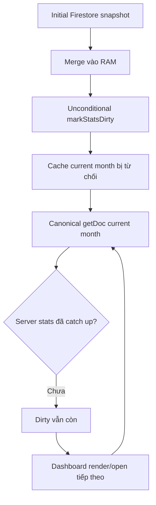
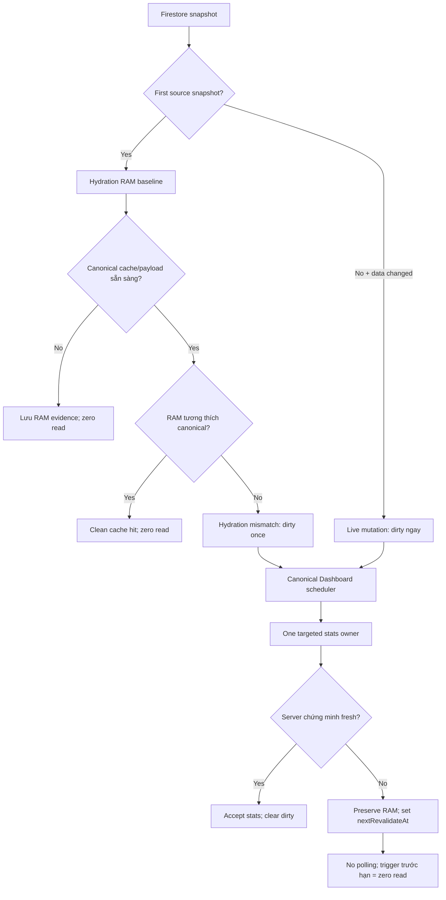
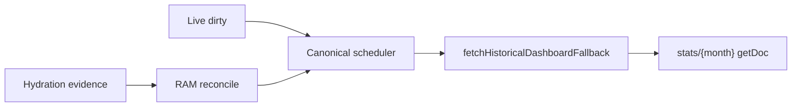

# PHASE 4K-6V5U6C2 — Dashboard Hydration-vs-Mutation Freshness Guard + Unresolved Dirty Read Backoff

Build version:

`4K-6V5U6C2-dashboard-hydration-mutation-guard-20260812`

## Kết luận

Phase C2 hoàn tất và toàn bộ gate bắt buộc PASS. Dashboard hiện phân biệt rõ ba event `hydration-baseline`, `hydration-mismatch` và `live-mutation`; initial Firestore snapshot không còn tự động tạo dirty state. Initial RAM vẫn được đối chiếu với canonical current-month payload nên cache cũ vẫn bị phát hiện. Dirty chưa được server xác nhận được giữ bằng RAM authority và chỉ đủ điều kiện đọc lại sau backoff 90 giây trên một Dashboard trigger hợp lệ; không có polling hoặc network owner mới.

Cache schema tiếp tục dùng `v3` vì hydration/backoff metadata chỉ tồn tại trong RAM.

## BEFORE — false-dirty graph



Hai nguồn false dirty đã xác nhận ở C1:

- Transaction `_mergeAndRender()` đánh dấu finance dirty ngay cả với snapshot đầu tiên.
- Profile `activeSnapshotCount === 1` đánh dấu members dirty dù chỉ là hydration.

Khi stats writer chưa catch up hoặc Viewer không chạy writer, mỗi lần mở/render Dashboard có thể lặp lại targeted `getDoc(stats/currentMonth)`.

## AFTER — hydration/mutation graph



## Thiết kế đã triển khai

### Transaction hydration và mutation

- Reuse `_txSourceSnapshotSeen`; `_recordTxSourceSnapshot(sourceKey, snap)` trả metadata `{ initial, sourceKey }`.
- Canonical mode: snapshot đầu tiên của `accountingMonths` là hydration; RAM được commit trước khi reconcile.
- Legacy mode: giữ nguyên ba listener `date`, `txMonth`, `packageMonths`. Hydration chỉ hoàn tất sau khi cả ba initial snapshots đã đến, không phụ thuộc thứ tự.
- Mỗi initial callback vẫn merge để UI đầy đủ nhưng không callback nào bị xem là live mutation.
- Sau baseline, merged transaction fingerprint chỉ đánh dấu dirty khi RAM thực sự thay đổi. Một giao dịch xuất hiện trong hai/ba legacy callbacks vẫn chỉ tạo một finance dirty revision.
- Dirty của mutation đầu tiên được ghi ngay trước invalidation Dashboard coalesced 120 ms, nên stale cache không có cửa áp current point trước dirty guard.

### Profile hydration và mutation

- `activeSnapshotCount === 1` ghi members hydration evidence, không unconditional dirty.
- Snapshot sau chỉ đánh dấu members dirty khi `docChanges()` có `added`, `modified` hoặc `removed`.
- Existing active-zero/full fallback cập nhật lại hydration evidence bằng active set hoàn chỉnh, không tạo Dashboard read.
- Coach bị loại khỏi cả reconciliation và dirty marking; Coach vẫn giữ Attendance-only boundary.

### RAM-only hydration reconciliation

API `reconcileDashboardHydrationEvidence(...)` nằm trên owner hiện hữu `window._moduleDashboard` và không gọi Firestore.

Finance rules:

- `stats.txCount < localMonthTxCount` → mismatch.
- Count bằng nhau và RAM coverage đủ nhưng income/expense khác → mismatch.
- `stats.txCount > localMonthTxCount` → không mặc định coi stats stale, giữ protection cho listener coverage bị giới hạn.

Members rules:

- So sánh active/current count.
- So sánh new/quit khi cả RAM evidence và canonical coverage cùng khả dụng.
- Provisional active-zero probe không tạo false mismatch trước existing full fallback.

Nếu canonical payload chưa tồn tại, evidence ở trạng thái pending và không tạo dirty chỉ vì thiếu payload. Canonical loader sẽ reconcile trước cache-hit apply hoặc trên chính cold six-read response, không mở thêm network flight.

### Unresolved dirty backoff

Dirty entry hiện có:

```text
revision
dirtyAt
lastAttemptAt
attemptCount
nextRevalidateAt
```

Policy:

- Backoff cố định: 90 giây.
- Một targeted canonical read không chứng minh fresh → giữ dirty, giữ RAM authority, đặt `nextRevalidateAt`.
- Dashboard trigger trước deadline → zero additional stats read.
- Trigger hợp lệ sau deadline → tối đa một targeted current-month read.
- Mutation revision mới reset `lastAttemptAt`, `attemptCount`, `nextRevalidateAt`, nên cooldown cũ không che mutation mới.
- Không `setInterval`, không recursive fetch timer, không background polling.

### Metrics

Mở rộng đúng global hiện hữu `window.__sparkReadMetrics`:

- `dashboardHydrationBaseline`
- `dashboardHydrationMismatch`
- `dashboardInitialDirtySkipped`
- `dashboardLiveMutationDirty`
- `dashboardDirtyReadBackoffSkipped`
- `dashboardDirtyRevalidationAttempts`
- `dashboardDirtyResolved`

Không tạo metrics global thứ hai.

## Acceptance evidence

| Scenario | Evidence | Kết quả |
|---|---|---|
| Finance initial match | Cache/RAM: income `20,000,000`, expense `100,000`, txCount `100` | Clean; Dashboard call #1 = 0 targeted reads; call #2 = 0 |
| Member initial match | Cache/RAM active = `100` | Clean; 0 targeted reads |
| Viewer matching cache | Viewer không phụ thuộc stats writer; mở Dashboard 5 lần trong TTL | `dirtyMonths = 0`; tổng stats reads = 0 |
| Finance hydration mismatch | Cache count/income `100`/`20,000,000`; RAM `101`/`20,500,000` | Hydration mismatch dirty đúng 1 revision; targeted read ≤ 1; RAM không bị overwrite |
| Members hydration mismatch | Canonical active khác initial active RAM | Members dirty đúng 1; targeted read ≤ 1; selected chart point dùng RAM |
| Real transaction mutation | New payment sau hydration baseline | Finance live-mutation revision +1 |
| Real profile mutation | Snapshot sau có real `added/modified/removed` | Members live-mutation dirty đúng 1 cho snapshot |
| Legacy three-source hydration | `byDate`, `byTxMonth`, `byPackageMonths` initial | Dirty revision tăng 0 khi cache/RAM match |
| Legacy duplicate mutation burst | Một transaction xuất hiện qua nhiều source callbacks | Một merged fingerprint change → một dirty revision; ≤ 1 canonical flight |
| Unresolved finance dirty | RAM count 101; server stats count 100 | First revalidation = 1 read; RAM preserved; dirty retained |
| Repeated trigger during cooldown | Gọi canonical loader thêm 10 lần trước deadline | 0 additional reads |
| Retry eligibility | Advance clock qua `nextRevalidateAt` rồi trigger Dashboard | 1 targeted read; không có read nền trước deadline |
| Mutation during backoff | Revision 10 cooldown; new transaction tạo revision 11 | Revision 11 reset cooldown và đủ điều kiện revalidate ngay |
| Server catch-up | Server lên `20,500,000`, `updatedAt >= dirtyAt` | Next eligible read accepted; dirty cleared |
| Coach | Initial/profile callbacks ở Coach | 0 Dashboard dirty marks; 0 Dashboard stats reads |
| Historical months | Current month dirty/backoff; 5 tháng trước clean trong TTL | Historical cache tiếp tục 0 reads |

Gate mới `check:dashboard-hydration-mutation-guard` đạt `44/44`. Gate freshness mở rộng đạt `49/49`. Parallel authority gate đạt `27/27` và xác nhận hydration reconciliation không đọc Firestore, backoff không tạo network owner thứ hai, toàn bộ targeted stats reads vẫn ở canonical loader.

## ONE Dashboard Firestore network authority



`render.js`, transaction owner và profile owner không đọc Dashboard stats. Existing canonical scheduler/loader là owner duy nhất. Không thêm query hoặc listener Firestore.

## Static Firestore read budget

| API | Baseline | C2 | Acceptance |
|---|---:|---:|---:|
| `getDoc` | 31 | 31 | ≤ 31 |
| `getDocs` | 56 | 56 | ≤ 56 |
| `onSnapshot` | 16 | 16 | ≤ 16 |

`check:startup-read-budget-freeze`: `PASS 8/8`.

## Regression results

| Gate | Kết quả |
|---|---:|
| `check:syntax` | EXIT 0 — 244 items |
| `check:dashboard-hydration-mutation-guard` | PASS 44/44 |
| `check:dashboard-cache-freshness-guard` | PASS 49/49 |
| `check:dashboard-single-read-authority` | PASS 38/38 |
| `check:parallel-read-authority` | PASS 27/27 |
| `check:startup-read-budget-freeze` | PASS 8/8 |
| `check:club-bootstrap-single-read-authority` | PASS 20/20 |
| `check:club-initial-snapshot-access-gate` | PASS 39/39 |
| `check:auth-context-single-writer` | PASS 40/40 |
| `check:notification-single-read-authority` | PASS 17/17 |
| `check:canonical-transaction-safe-cutover` | PASS 27/27 |
| `check:firestore-read-attribution-canonical-tx-boundary` | PASS 34/34 |
| `check:v5u2-tuition-command-behavior` | EXIT 0 |
| `check:inventory-ledger-reconciliation` | PASS 33/33 |
| `check:attendance-canonical-ownership` | EXIT 0 — 141 assertions |
| `check:coach-attendance-only-read-boundary` | PASS 30/30 |
| `check:security-coach-branch-boundary` | PASS 35/35 |
| `check:production-stability-gate` | PASS 22/22 |
| `npm run check` | EXIT 0 |
| `npm run check:all:critical` | EXIT 0 |
| `npm run check:all` | EXIT 0 |

## Root/public build and hash

`npm run build:public`: EXIT 0.

Runtime same-path verification:

| Check | Result |
|---|---:|
| Runtime files compared | 122 |
| `public missing` | 0 |
| `public extra` | 0 |
| `different` | 0 |
| Aggregate SHA-256 manifest | `fd288f16a62f2d7f44df19948305563e9b94c4c64d16be344810fd627f8775aa` |

Không sửa tay riêng `public`; toàn bộ public runtime được tạo bằng `npm run build:public`.

## Scope confirmation

- Không sửa business logic Học phí, Báo nợ, Kho đồ, Điểm danh hoặc Thi đai.
- Không sửa transaction query model; canonical `accountingMonths` và legacy `date`/`txMonth`/`packageMonths` vẫn mutually exclusive như baseline.
- Không sửa `functions/` và không deploy Cloud Functions.
- Không sửa `firestore.rules`.
- Không migration.
- Không sửa Attendance trong C2.

## Known remaining issues

- **V5U6D Attendance Daily Single Read/Refresh Authority + Latest-Wins Guard**.
- **Cloud Functions/client stats writer deployment truth UNKNOWN**.
- **rule-level club lock/expiry hardening pending**.

Theo Definition of Done, Dashboard hardening dừng tại đây sau khi toàn bộ gate PASS. Phase tiếp theo là V5U6D và không thuộc phạm vi C2.
