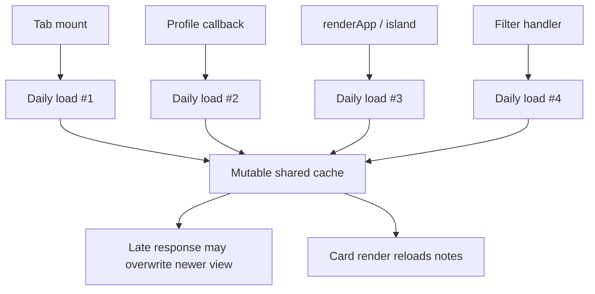
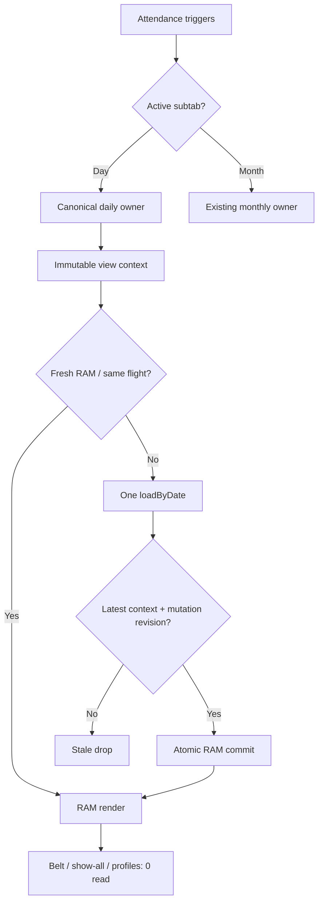

# PHASE 4K-6V5U6D — Attendance Daily Single Refresh Authority Report

Ngày hoàn tất: **2026-08-13**  
Build: **`4K-6V5U6D-attendance-daily-single-refresh-authority-20260813`**  
Kết quả: **PASS**

## 1. Phạm vi và kết luận

V5U6D hội tụ toàn bộ trigger Điểm danh ngày vào một runtime orchestration owner duy nhất:

```text
AttendanceModule.requestDailyRefresh()
    -> _requestAttendanceDailyRefresh()
    -> AttendanceService.loadByDate()
```

`window.renderAttendanceList` vẫn tồn tại để tương thích inline/legacy nhưng chỉ còn là compatibility delegate. `AttendanceService.loadByDate()` xuất hiện đúng **một invocation** trong canonical daily loader.

Kết quả chính:

- Ba request cùng context dùng một daily flight; dynamic gate đo **1 loadByDate**, ít nhất **2 coalesced callers**.
- Response cũ theo date, branch, shift, club hoặc auth generation không thể commit cache/DOM.
- Read bắt đầu trước `toggleAttendance()` hoặc `bulkCheckIn()` không thể xóa trạng thái optimistic mới.
- Belt, show-all, profile/name/nickname render và generic render storm dùng RAM, không đọc lại daily Firestore.
- Day subtab không gọi monthly loader; Month subtab không gọi daily loader; main tab ẩn không gọi cả hai.
- Shifts, admin coach notes và own session note đều có single-flight/cache guard.
- Không thêm Firestore reader/listener, không polling, không sửa Rules, Functions hoặc schema.

## 2. BEFORE — trigger/read graph



Hai call đồng thời trước phase có thể tạo `loadShifts = 2`, `loadByDate = 2`; Admin còn có `loadCoachNotes = 2`, `loadSessionNote = 2`.

## 3. AFTER — canonical refresh graph



Canonical daily identity là `clubId|date|branch|shiftId`. Cache và coalescing còn kiểm tra `authGeneration`; do đó logout/login lại cùng CLB và cùng query key vẫn không chia sẻ flight/cache của phiên cũ.

## 4. Canonical daily authority

State tối thiểu nằm trong `js/modules/attendance.js`:

- `requestGeneration`
- `currentSnapshotKey`, `currentSnapshotAuthGeneration`, `currentSnapshotAt`
- `inFlight: Map`
- `latestIntent`
- `mutationRevision`
- `cacheReady`

Mỗi actual network request capture immutable token gồm:

- `generation`
- `clubId`
- `authGeneration`
- `role`
- `date`
- `branch`
- `shiftId`
- `mutationRevision`

Commit chỉ được phép khi token vẫn khớp context hiện tại, latest intent, request generation và mutation revision. Stale success/error đều không clear cache mới và không đưa UI mới trở lại loading.

TTL daily mặc định là **20 giây**, chỉ để hấp thụ render storm. Auxiliary cache TTL là **30 giây**. Không có `setInterval`, recursive timer hoặc background polling.

## 5. Dynamic race evidence

Gate: `check:attendance-daily-single-refresh-authority` — **73/73 PASS**.

| Case | Dynamic evidence | Kết quả |
|---|---:|---|
| 3 same-context calls | daily loads `1`, coalesced `>=2` | PASS |
| Date 12 -> 13; B resolve trước A | B status `2`; A stale-drop `1` | PASS |
| Branch CS1 -> CS2 | CS2 cards giữ nguyên sau CS1 late response | PASS |
| Shift A -> B | snapshot cuối có key `shift-b` | PASS |
| Club A -> Club B | Club A late response không mutate Club B | PASS |
| Same club, auth generation 70 -> 71 | flight cũ không được share; cache ghi auth `71` | PASS |
| Toggle trong lúc read cũ chạy | Alice giữ status `1`; mutation-drop `+1` | PASS |
| Bulk check-in trong lúc read cũ chạy | Alice/Bob giữ status `1` | PASS |

Mỗi distinct date, branch và shift intent tạo đúng **một** daily read trong simulation; không có parallel owner thứ hai.

## 6. Presentation-only evidence

Sau khi có accepted daily snapshot:

- Belt filter x5: **0 daily reads**.
- Show-all x5: **0 daily reads**.
- Profile nickname/display update: **0 daily reads**, card HTML vẫn cập nhật.
- Generic/listener/island presentation trigger dùng `AttendanceModule.renderDailyFromRam()`.
- Profile listener không còn `invalidate + direct renderAttendanceList` dual path.

Nếu Day subtab visible nhưng chưa từng có daily snapshot, canonical owner được phép cold-load đúng một lần.

## 7. Day/Month subtab isolation

Nested visibility được kiểm tra bởi:

- `_isAttendanceDaySubtabActive()`
- `_isAttendanceMonthSubtabActive()`

Dynamic evidence:

| UI state | `loadByDate` | `loadByMonth` |
|---|---:|---:|
| Main Attendance + Day visible | allowed `0/1` theo cache | `0` |
| Main Attendance + Month visible | `0` | `1` canonical monthly flow |
| Main Attendance hidden | `0` | `0` |

Monthly pagination, AbortController, stale request guard, export và công thức chuyên cần không thay đổi. Attendance canonical ownership gate vẫn PASS **141 assertions**; scheduled accuracy PASS **22/22**.

## 8. Shifts và auxiliary reads

### Shifts

`_clubShiftsLoadPromise` là Promise latch theo club. Dynamic test chạy đồng thời daily render, `ensureShiftsLoaded` và open shift modal:

- `loadShifts = 1`
- `shiftsCoalesced >= 2`

Late Club A/auth response không commit vào Club B/current auth. Reset module xóa shifts, loaded-club identity và running Promise reference.

### Admin coach-notes summary

Coach notes không còn được gọi từ `_renderAttCards()`. Nó chỉ chạy sau accepted daily lifecycle, key `clubId|date`, có RAM cache và Promise single-flight. Old context không được apply.

### Own session note

Session note dùng key `clubId|uid|date`, `_sessionNoteInFlight: Map` và `hasOwnProperty` trên cache. `null` là trạng thái hợp lệ “đã load nhưng document không tồn tại”, không bị hiểu nhầm là cache miss. Save/delete cập nhật cache ngay, không point-read lại.

Admin same-context duplicate evidence:

```text
shifts      = 1
daily       = 1
coachNotes  = 1
sessionNote = 1
```

Sau đó năm presentation renders:

```text
additional daily/coachNotes/sessionNote = 0
```

Coach cold evidence:

```text
shifts      = 1
daily       = 1
sessionNote = 1
coachNotes  = 0
```

## 9. Read-count matrix

Các số dưới đây là Firestore execution shape của một context đã nêu rõ; `<=1` phản ánh document có thể đã nằm trong short RAM cache.

| Trigger | Shifts point read | Daily query | Admin coach-notes query | Session-note point read | Monthly query |
|---|---:|---:|---:|---:|---:|
| Admin cold Day open | `1` | `1` | `1` | `1` | `0` |
| Coach cold Day open | `1` | `1` | `0` | `1` | `0` |
| Warm same-view render | `0` | `0` | `0` | `0` | `0` |
| Belt/show-all | `0` | `0` | `0` | `0` | `0` |
| Warm profile-only update | `0` | `0` | `0` | `0` | `0` |
| Date change to new date | `0` | `1` | `<=1` | `<=1` | `0` |
| Branch change, same date | `0` | `1` | `0` | `0` | `0` |
| Shift change, same date | `0` | `1` | `0` | `0` | `0` |
| Switch to Month | `0` | `0` | `0` | `0` | existing monthly flow |

## 10. Coach branch/security evidence

- Daily context canonicalizes Coach branch bằng existing `BranchIdentity`.
- Dynamic Coach request truyền `branch = CS1` và không tải admin coach-notes summary.
- Service vẫn fail-closed nếu Coach thiếu branch.
- Daily query giữ date + assigned branch + selected shift + `attendanceDailyLimit`.
- Coach attendance-only boundary: **30/30 PASS**.
- Security/branch boundary: **35/35 PASS**.
- Không mount transactions, inventory, debt, full-profile hoặc Dashboard stats cho Coach.

## 11. Diagnostics và attribution

Existing `window.__attendanceDebug` được mở rộng, không tạo metrics global thứ hai:

- `dailyIntentCount`
- `dailyNetworkLoads`
- `dailySingleFlightCoalesced`
- `dailyCacheHits`
- `dailyStaleDropped`
- `dailyMutationRevisionDropped`
- `dailyPresentationOnlyRenders`
- `dailyLastKey`
- `shiftsLoads`, `shiftsCoalesced`
- `coachNotesLoads`, `coachNotesCoalesced`
- `sessionNoteLoads`, `sessionNoteCacheHits`, `sessionNoteCoalesced`
- `daySubtabMonthlyReadPrevented`
- `monthSubtabDailyReadPrevented`

Existing Firestore attribution API ghi các owner:

- `attendance.daily`
- `attendance.shifts`
- `attendance.coachNotes`
- `attendance.sessionNote`

Metrics chỉ ghi read đã xảy ra; không tạo query để đo metrics.

## 12. Static Firestore budget

| API | C2 baseline | V5U6D actual | Acceptance |
|---|---:|---:|---:|
| `getDoc` | 31 | **31** | `<=31` |
| `getDocs` | 56 | **56** | `<=56` |
| `onSnapshot` | 16 | **16** | `<=16` |

`check:startup-read-budget-freeze`: **8/8 PASS**. Không thêm listener/query call-site.

## 13. Regression results

| Gate | Kết quả |
|---|---:|
| `check:syntax` | PASS — 244 items |
| `check:attendance-daily-single-refresh-authority` | **73/73 PASS** |
| `check:attendance-canonical-ownership` | **141 assertions PASS** |
| `check:attendance-reliability` | **20/20 PASS** |
| `check:attendance-scheduled-accuracy` | **22/22 PASS** |
| `check:attendance-offline-shift` | **18/18 PASS** |
| `check:attendance-shift-filter` | **10/10 PASS** |
| `check:coach-attendance-only-read-boundary` | **30/30 PASS** |
| `check:security-coach-branch-boundary` | **35/35 PASS** |
| `check:parallel-read-authority` | **39/39 PASS** |
| `check:startup-read-budget-freeze` | **8/8 PASS** |
| `check:dashboard-hydration-mutation-guard` | **44/44 PASS** |
| `check:dashboard-cache-freshness-guard` | **49/49 PASS** |
| `check:dashboard-single-read-authority` | **38/38 PASS** |
| `check:club-bootstrap-single-read-authority` | **20/20 PASS** |
| `check:club-initial-snapshot-access-gate` | **39/39 PASS** |
| `check:canonical-transaction-safe-cutover` | **27/27 PASS** |
| `check:firestore-read-attribution-canonical-tx-boundary` | **34/34 PASS** |
| `check:v5u2-tuition-command-behavior` | PASS |
| `check:inventory-ledger-reconciliation` | **33/33 PASS** |
| `check:production-stability-gate` | **22/22 PASS** |
| `npm run check` | **EXIT 0** |
| `npm run check:all:critical` | **EXIT 0** |
| `npm run check:all` | **EXIT 0** |

## 14. Root/public and package integrity

`npm run build:public` là owner duy nhất tạo public mirror. Full same-path SHA-256 audit cho:

- `index.html`
- `app.js`
- `style.css`
- `.nojekyll`
- `js/**`
- `css/**`

Kết quả:

```text
runtime files = 122
missing       = 0
different     = 0
extra         = 0
```

`firestore.rules` không đổi; SHA-256 giữ nguyên:

```text
56522af42761702329e1fb0d730f321d18b22e81de6a8b8a6e74b2cf270c271a
```

Toàn bộ `functions/**` có cùng hash với C2. Không deploy Functions, không sửa Rules, không migration.

## 15. Runtime files thay đổi

- `index.html`
- `app.js`
- `js/main.js`
- `js/modules/attendance.js`
- `js/services/attendance.service.js`
- `js/events/attendance.events.js`
- `js/listeners/attendance.listeners.js`
- `js/listeners/profiles.listeners.js`
- `js/ui/render.js`
- `js/ui/render/renderAttendance.js`
- `js/ui/tabs.js`

Cache-bust V5U6D được gắn cho mọi changed nested runtime module. Ngoài ra chỉ thay `package.json` và regression tools/report.

## 16. Boundaries giữ nguyên

- Không đổi 4 trạng thái điểm danh `0/1/2/3`.
- Không đổi monthly attendance calculations, pagination hoặc export.
- Không đổi transaction query model.
- Không đổi Dashboard C2 freshness/backoff/runtime.
- Không đổi học phí, báo nợ, kho đồ hoặc thi đai.
- Không đổi Firestore Rules, Cloud Functions hoặc data schema.

## 17. Known remaining issues

1. **Attendance all-shifts aggregation semantics requires separate correctness decision.** Khi không chọn shift, policy tổng hợp record nhiều ca chưa được suy đoán trong V5U6D.
2. **Dashboard truly-empty-profile hydration edge remains technical debt.** Collection profiles thực sự rỗng cùng cached `members.active > 0` có thể giữ state `unknown`.
3. **Cloud Functions/client stats writer deployment truth UNKNOWN.** Source regression PASS nhưng trạng thái deploy production không được xác minh trong phase này.
4. **Rule-level club account lock/expiry hardening pending.** Không sửa Rules trong V5U6D.

## 18. Definition of Done

V5U6D đạt Definition of Done: một canonical daily refresh authority, same-key single-flight, latest-wins cho date/branch/shift/club/auth, local mutation guard, RAM-only presentation filters/profile refresh, shifts/notes coalescing, nested subtab read isolation, Coach branch scope, zero new Firestore call-site, full regressions EXIT 0 và root/public synchronized.

