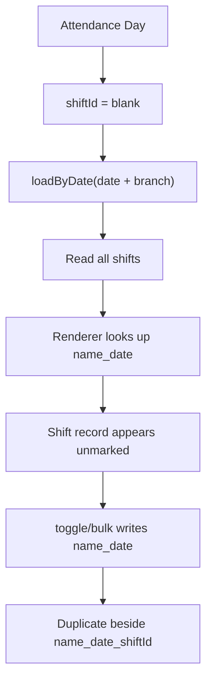
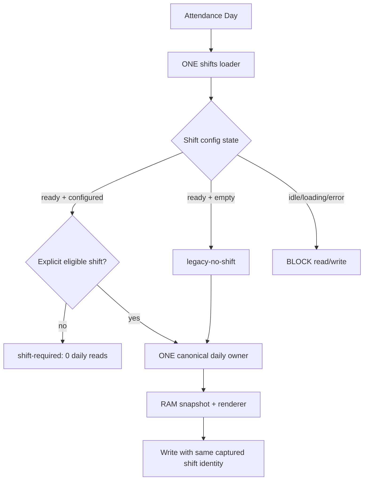

# PHASE 4K-6V5U6F — Attendance Explicit Shift Authority Report

Build version:

```text
4K-6V5U6F-attendance-explicit-shift-authority-20260814
```

Ngày kiểm chứng: **2026-08-14**  
Kết quả: **PASS**

## 1. Phạm vi và kết luận

V5U6F đóng semantics nguy hiểm của selector ca trống khi CLB đã cấu hình ca:

- `configured shifts + blank` không còn đọc tất cả ca.
- `configured shifts + blank/invalid` không thể ghi document `name_date`.
- Chỉ ca explicit, tồn tại trong danh sách ca hợp lệ theo cơ sở/Coach, mới được làm daily read/write authority.
- CLB có cấu hình ca rỗng authoritative vẫn dùng legacy no-shift mode.
- Lỗi tải cấu hình ca là trạng thái `error/unknown`, không bị biến thành danh sách rỗng.
- V5U6D daily single-flight/latest-wins/mutation-revision authority được giữ nguyên.

Không có Firestore listener, reader owner, polling, migration hay schema rewrite mới.

## 2. BEFORE — read/write graph



Rủi ro trước V5U6F:

- Blank shift tiêu tốn tới `attendanceDailyLimit` trên nhiều ca nhưng card lookup không map đúng record shift-aware.
- Toggle/bulk có thể tạo no-shift document song song với document ca đã tồn tại.
- Lỗi `loadShifts()` bị swallow thành `[]`, dẫn tới fail-open legacy mode.

## 3. AFTER — canonical shift authority



Canonical module-local state:

```text
_attendanceShiftAuthority
  clubId
  authGeneration
  status: idle | loading | ready | error
  configured: true | false | null
  eligibleCount
  selectedShiftId
  lastError
  updatedAt
```

`_resolveAttendanceShiftAuthority(context)` là helper thuần RAM. Helper không gọi `getDoc`, `getDocs`, `onSnapshot`, service loader, timer hoặc renderer.

## 4. Read/write policy evidence

| Scenario | Shift point read | Daily query | Attendance write | Kết quả |
|---|---:|---:|---:|---|
| Configured shifts + blank | `<= 1` cold, `0` warm | `0` | `0` | `shift-required` |
| Configured shifts + explicit eligible shift | cache reuse sau shifts load | `1` | allowed | `explicit-shift` |
| Same explicit context trong TTL | `0` thêm | `0` thêm | n/a | RAM cache hit |
| Authoritative empty shift list | `<= 1` cold | `1` | allowed | `legacy-no-shift` |
| Shift config load error | `1` failed attempt | `0` | `0` | `shift-config-unavailable` |
| Concurrent retry/ensure cùng club/auth | `1` | theo policy | theo policy | same Promise coalesced |

### Configured blank shift

Dynamic gate xác nhận:

```text
shifts = [morning, evening]
selectedShiftId = ""

decision.mode = shift-required
AttendanceService.loadByDate calls = 0
toggle writes = 0
bulk writes = 0
offline queue mutations = 0
grid = "Vui lòng chọn ca tập để điểm danh"
```

Cache của ca trước không bị render trong trạng thái blank. Canonical cache có thể được giữ lại nội bộ để reuse khi user chọn lại đúng ca, nhưng presentation authority vẫn bị chặn.

### Explicit shift

Dynamic gate xác nhận:

```text
selectedShiftId = morning
AttendanceService.loadByDate calls = 1
options.shiftId = morning
options.requireShift = true
options.shiftAuthorityMode = explicit-shift
```

Record `A_2026-08-14_morning` được map đúng lên card. Toggle online ghi doc ID và payload cùng `shiftId=morning`.

### Legacy no-shift

Khi shifts settings load thành công với danh sách rỗng:

```text
status = ready
configured = false
mode = legacy-no-shift
daily query = 1
legacy name_date compatibility = preserved
```

Không dùng lỗi network/permission để suy ra `configured=false`.

### Shift config error

Khi `AttendanceService.loadShifts()` throw:

```text
status = error
configured = null
daily query = 0
toggle/bulk/offline writes = 0
```

Retry đi qua chính `_loadClubShifts({ force: true })` và `_clubShiftsLoadPromise`; không có shifts loader thứ hai.

## 5. Duplicate no-shift prevention

Với record đã tồn tại:

```text
A_2026-08-14_morning
```

và configured shift state + blank selector, cả `toggleAttendance(A)` và `bulkCheckIn()` return trước:

- `_markAttendanceDailyMutation`
- optimistic cache mutation
- offline queue mutation
- Firestore save/delete/bulk write
- profile attendance-stat mutation

Kết quả dynamic:

```text
new A_2026-08-14 document = NOT CREATED
Firestore attendance writes = 0
```

## 6. Stale response evidence

### Shift A → Shift B

```text
A starts
B starts
B resolves and commits
A resolves late
```

Kết quả:

- B là final visible snapshot.
- A bị stale-drop.
- V5U6D latest-wins token/generation không bị thay thế.

### Shift A → blank

```text
A starts
selector becomes blank
new intent = shift-required
A resolves late
```

Kết quả:

- Blank intent tăng existing request generation.
- A không commit cache/presentation.
- Grid vẫn ở `shift-required`.
- Blank intent không tạo daily query mới.

### Branch change

```text
CS1 + shift CS1-A
→ branch CS2
```

Ca không hợp lệ bị clear bằng RAM policy, daily reads trong trạng thái blank = `0`. Sau khi chọn ca CS2-B hợp lệ, canonical owner thực hiện đúng `1` daily query.

## 7. Coach branch/security evidence

Coach CS1 chỉ nhận:

- ca global, hoặc
- ca canonical cùng CS1 (`BranchIdentity`/`_sameBranch`).

Ca CS2 không xuất hiện trong eligible list và không thể làm query authority. Configured blank của Coach tạo `0` daily reads.

Các gate giữ nguyên:

```text
Coach Attendance-Only Boundary     30/30 PASS
Coach Security Branch Boundary     35/35 PASS
Coach Branch Runtime Repair        25/25 PASS
```

Không cấp thêm quyền Rules và không mount transactions/inventory/stats cho Coach.

## 8. Offline evidence

- Explicit shift offline write được phép và queued record mang `shiftId` + shift-aware `docId`.
- Configured blank offline write bị chặn trước localStorage mutation.
- Offline synchronization load cấu hình ca qua cùng shifts owner.
- Queued records không có eligible explicit shift không được sync khi CLB đang configured.
- Historical queue có shift ID hợp lệ vẫn được sync; không migration queue.

## 9. Metrics

Existing `window.__attendanceDebug` được mở rộng, không tạo metrics global thứ hai:

```text
shiftRequiredBlockedReads
shiftRequiredBlockedWrites
shiftConfigErrors
shiftConfigRetryCount
legacyNoShiftReads
explicitShiftReads
invalidSelectedShiftCleared
blankShiftAllReadPrevented
blankShiftWritePrevented
```

## 10. Single-authority/static budget evidence

```text
ONE _requestAttendanceDailyRefresh owner       PASS
AttendanceService.loadByDate invocation        exactly 1 module call site
ONE _loadClubShifts owner                      PASS
ONE _clubShiftsLoadPromise latch               PASS
No second daily in-flight map                  PASS
No new onSnapshot                              PASS
No polling                                     PASS
```

Static Firestore runtime call sites:

| API | V5U6F actual | Acceptance |
|---|---:|---:|
| `getDoc` | 31 | `<= 31` |
| `getDocs` | 56 | `<= 56` |
| `onSnapshot` | 16 | `<= 16` |

`check:startup-read-budget-freeze`: **8/8 PASS**.

## 11. Regression results

### New/frozen authority gates

| Gate | Result |
|---|---:|
| `check:syntax` | 246/246 PASS |
| `check:attendance-explicit-shift-authority` | 60/60 PASS |
| `check:attendance-daily-single-refresh-authority` | 73/73 PASS |
| `check:parallel-read-authority` | 46/46 PASS |
| `check:production-authority-closure` | 64/64 PASS |
| `check:startup-read-budget-freeze` | 8/8 PASS |

### Mandatory domain regressions

| Gate | Result |
|---|---:|
| `check:attendance-canonical-ownership` | 141 assertions PASS |
| `check:attendance-reliability` | 20/20 PASS |
| `check:attendance-schedule` | PASS |
| `check:attendance-offline-shift` | PASS |
| `check:attendance-shift-filter` | PASS |
| `check:club-bootstrap-single-read-authority` | 20/20 PASS |
| `check:club-initial-snapshot-access-gate` | 39/39 PASS |
| `check:auth-context-single-writer` | 40/40 PASS |
| `check:dashboard-single-read-authority` | 38/38 PASS |
| `check:dashboard-cache-freshness-guard` | 49/49 PASS |
| `check:dashboard-hydration-mutation-guard` | 44/44 PASS |
| `check:canonical-transaction-safe-cutover` | 27/27 PASS |
| `check:firestore-read-attribution-canonical-tx-boundary` | 34/34 PASS |
| `check:v5u2-tuition-command-behavior` | PASS |
| `check:debt-authoritative-tuition-coverage` | 32/32 PASS |
| `check:inventory-ledger-reconciliation` | 33/33 PASS |
| `check:coach-attendance-only-read-boundary` | 30/30 PASS |
| `check:security-coach-branch-boundary` | 35/35 PASS |
| `check:production-stability-gate` | 22/22 PASS |

### Full suites

```text
npm run check                  EXIT 0
npm run check:all:critical     EXIT 0
npm run check:all              EXIT 0
```

Hai legacy static gates được cập nhật để nhận diện an toàn hơn:

- Attendance reliability chấp nhận immutable guarded capture `writeDate/writeShiftId`, đồng thời vẫn bắt buộc doc ID và payload dùng cùng shift.
- Coach branch repair nhận cache lineage V5U6F và `_getEligibleAttendanceShifts()` dùng canonical `_sameBranch`; không nới Coach scope.

## 12. Root/public synchronization

Sau `npm run build:public`:

```text
checked   = 123 runtime files
missing   = 0
different = 0
extra     = 0
```

Phạm vi hash gồm:

```text
index.html
app.js
style.css
.nojekyll
js/**
css/**
```

Runtime source SHA-256:

```text
097d81dfa85f3d97944eaa5333e78fd9f1154204562b60801065efcd653411bf  index.html
a0f5c7997b06fb6a598bb04dfe2413f808193d009f29473c34117c0598e402ed  app.js
735bad0f665381e441fc6ed09a2c57ca12f2c42c275bf009e5c374ac2fed1331  js/main.js
6457d02f16fbe7f1712c95556b77b2f23df1c53b7d1f532a0e12bf47651accec  js/modules/attendance.js
b080eba9e590c238416f54a301b7d7331942690d704e2ed8ede0ed768f627901  js/services/attendance.service.js
```

## 13. Scope audit

Byte-identical với V5U6E:

```text
app.js
firestore.rules
firebase.json
js/modules/dashboard.js
js/core/productionAuthorityPolicy.js
js/core/clubStatsAutoCache.js
js/core/transactionCanonicalBoundary.js
functions/**
```

Runtime files thực sự đổi:

```text
index.html
js/main.js
js/modules/attendance.js
js/services/attendance.service.js
```

Test/tooling files đổi:

```text
package.json
tools/check-attendance-explicit-shift-authority.mjs
tools/check-attendance-daily-single-refresh-authority.mjs
tools/check-attendance-reliability.mjs
tools/check-coach-branch-runtime-repair.mjs
tools/check-parallel-read-authority.mjs
```

## 14. Verification limits and remaining status

```text
REMOTE FUNCTIONS DEPLOYMENT STATUS = UNKNOWN
```

Không có authoritative remote deployment tooling/credentials được dùng trong workspace này. Không tuyên bố Functions đã undeploy hoặc verified off.

Production tenant smoke với Firestore thật không được thực hiện vì workspace không có tenant credential/session. Các scenario tương đương được chạy deterministic trong dynamic V5U6F gate và đều PASS, gồm configured blank, explicit shift, legacy empty, config error, A→B, A→blank, branch change, Coach scope, online/offline write guard, add-first-shift và delete-selected-shift.

Không implement “Tất cả ca” aggregation cho daily cards. Nếu cần reporting all-shifts, đó phải là feature/reporting authority riêng.

## 15. Definition of Done

```text
ONE Attendance daily refresh owner                         PASS
ONE shifts loader / Promise latch                         PASS
configured + blank: daily reads=0, writes=0              PASS
configured + explicit: one daily query                   PASS
no configured shifts: legacy mode preserved              PASS
shift config error: fail closed                           PASS
blank cannot create name_date duplicate                   PASS
toggle/bulk/offline share the same shift guard            PASS
branch-invalid/deleted shift cannot query                 PASS
Coach eligible shifts are assigned/global only            PASS
A→B and A→blank stale protection                          PASS
no new getDoc/getDocs/onSnapshot call site                 PASS
no polling                                                 PASS
Dashboard/Transactions/Tuition/Debt/Inventory unchanged   PASS
all required/full suites                                   PASS
root/public synchronized                                   PASS
```

Sau V5U6F, Attendance daily được đóng băng theo yêu cầu. Phase tiếp theo có thể xem xét riêng:

```text
PHASE 4K-6V5U6G — Dashboard Truly-Empty Profiles Hydration Closure
```
